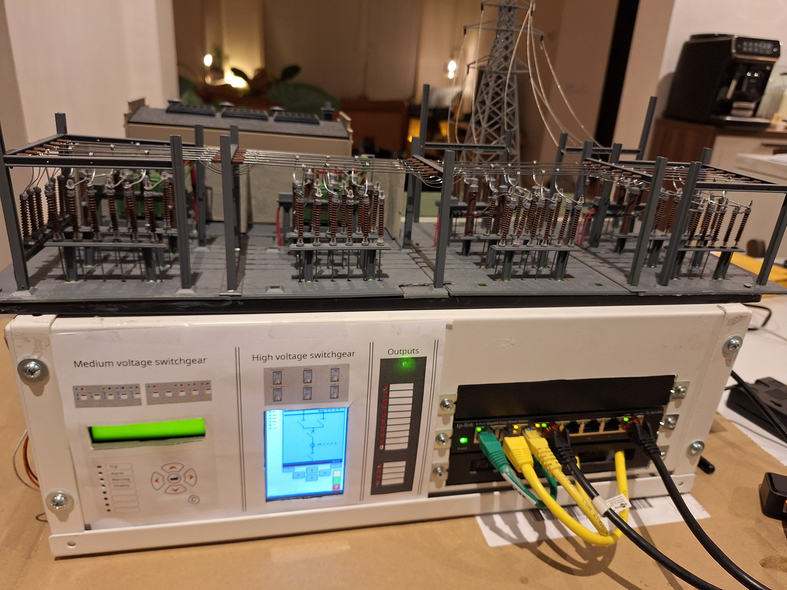
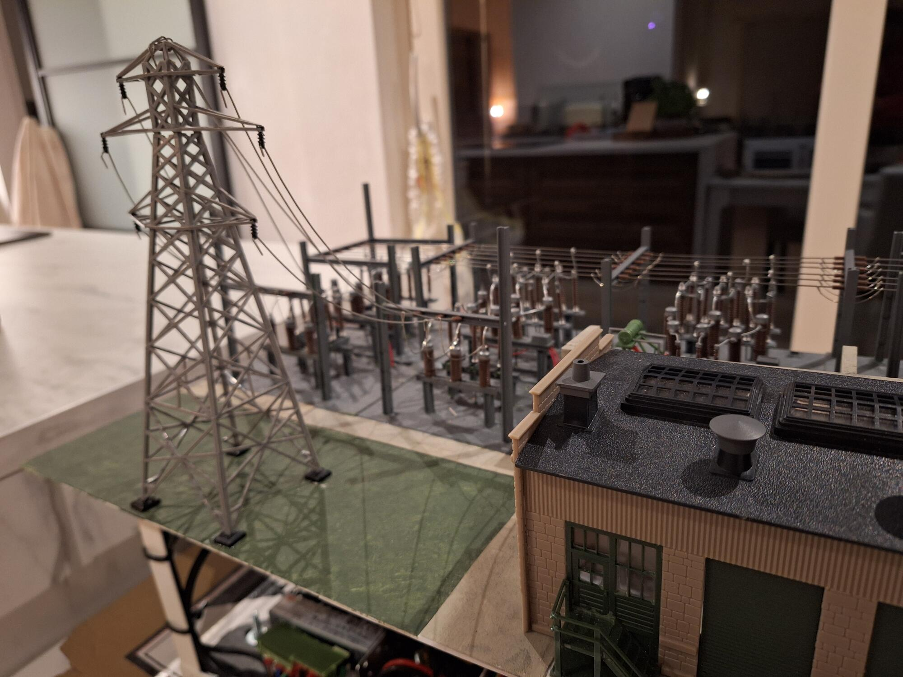

# Miniature IEC 61850 Substation

This project implements a fully automated **miniature high-voltage substation**, including switchyard, protection relay, CT simulation, medium-voltage switchgear, an IEC 61850/IEC 60870-5-104 gateway, HMI, and a central SCADA system.

It implements a hardware–software co-simulation implementing IEC 61850 communication using Raspberry Pi devices, an Arduino-based measurement unit, and a Linux HMI. The project combines physical components (servos, relay UI, Arduino I/O) with IEC 61850 servers, clients, and a gateway to simulate a realistic substation environment.

---

## 📸 Build Overview





---

## 🎯 Project Scope

This repository provides:

* A **miniature substation model** with moving switchgear
* A **protection relay simulation** with local UI
* A **measurement unit (Arduino)** with Modbus + serial interfaces
* A **gateway** bridging systems using IEC 61850
* A **local HMI** using IEC 61850 client functionality
* Configuration and data models for IEC 61850 (SCL-based)

It is designed for:

* IEC 61850 experimentation
* Hardware/software integration
* Substation modeling and visualization
* Educational and demonstration purposes

---

## 🏗️ Architecture (High-Level)

```
                +------------------------+
                |     Central SCADA      |
                |  (open_scada_dms)      |
                +-----------+------------+
                            |
                            | IEC60870-5-104
                            v
                  +---------+---------+
                  |  IEC61850/104     |
                  |  Gateway / RTU    |
                  +---------+---------+
                            |
                    +-------+------+
                    |   IEC61850   |
                    |   MMS/GOOSE  |
                    +-------+------+
                            |
 +--------------------------+--------------------------+
 |                          |                          |
 v                          v                          v
+------------+         +----------------+         +------------------+
| Switchyard |         | Protection     |         | HMI (EEE PC)     |
| (Servo Pi) |<------->| Relay (LCD Pi) |<------->| IEC61850 Client  |
+------------+  GOOSE  +----------------+   MMS   +------------------+
|
v
+-----------+
| CT Unit   |
| Arduino   |
+-----------+

```
---

## 🧱 System Components

### 📟 Measurement Unit (Arduino)

* Reads analog inputs (simulated current/measurements)
* Implements:

  * Serial communication with the switchyard for passing analog measurements
  * Modbus server (`ModbusSrv`)
* Firmware located in `firmware/arduino_relay`

### 🔌 Switchyard (Raspberry Pi)

* Controls servos representing disconnectors and breakers
* Runs a hardware service (`hw_service`)
* Interfaces with the arduino and other raspberry pi via serial

### ⚡ Protection Relay (Raspberry Pi)

* Runs:

  * Hardware service to interface with switchyrd over serial
  * 6 IEC 61850 servers connected to the switchyard for measurements and I/O 
  * UI service (LCD-based interface) for all 6 IEC 61850 servers
* Displays status and allows interaction
* Receives CT readings from Arduino
* Implements protection logic (overcurrent, interlocking, trip commands)


### 🌐 Gateway (Raspberry Pi)

* Runs IEC 61850 gateway service that supports an IEC 60870-5-104 server and IEC 61850 and modbus clients
* Uses:

  * `iec61850_open_gateway`
* Configured via:
  * `application_config/gateway_config_ini/`

### 🖥️ HMI (EEE PC)

* Runs IEC 61850/IEC 60870-5-104 client
* Displays SVG-based single line UI:

  * `application_config/local_hmi_svg/`

---


## 📡 Protocols Used

| Subsystem              | Protocols                                 |
| ---------------------- | ----------------------------------------- |
| IEC61850 Server/Client | MMS, GOOSE                                |
| Gateway/RTU            | IEC60870-5-104 → IEC61850/Modbus bridging |
| CT Arduino Unit        | Serial + Modbus TCP                       |
| Switchyard RPi         | Serial (commands)                         |
| SCADA & HMI            | IEC61850/IEC60870-5-104 Client            |

---

## 🧠 IEC 61850 Stack

This project depends on three external components (in `deps/`):

* `iec61850_open_server`
* `iec61850_open_client`
* `iec61850_open_gateway`
* `open_scada_dms`

These are expected to be cloned into:

```
deps/
├── iec61850_open_server
├── iec61850_open_client
├── iec61850_open_gateway
└── open_scada_dms
```

Configuration for these components is provided in:

```
application_config/iec61850_open_server_config/
```

Including:

* `.cfg` and `.ext` files (IED + data models)
* connector configs (`ui_connector.config`, `hw_connector.config`)

---

## 🗂️ Repository Structure

```
.
├── application_config/
│   ├── iec61850_open_server_config/
│   ├── gateway_config_ini/
│   ├── local_hmi_svg/
│   ├── SCL_files/
│   └── modbus_model/
│
├── firmware/
│   ├── arduino_relay/
│   ├── rpi_relay/
│   ├── rpi_switchyard/
│   └── rpi_gateway/
│
├── software/
│   ├── rly01/        # relay node software (UI + HW service)
│   └── hs01/         # switchyard node software
│
├── docs/
│   ├── architecture/
│   ├── hardware/
│   ├── communication_maps/
│   └── build_steps/
│
├── tests/
│   ├── 0_unit/
│   ├── 1_integration/
│   └── 2_system/
│
├── deps/
└── scripts/
```

---

## 🏗️ Architecture

### Hardware & System Views

#### Substation Overview


#### Station Bus Network


#### IEC 61850 Logical Nodes


#### GOOSE Mapping


#### Hardware Schematic


#### Data Model View


> Source: `docs/architecture/mini_substation.drawio`

---

## ⚙️ Configuration

### IEC 61850

Located in:

```
application_config/iec61850_open_server_config/
```

Includes:

* IED configurations (`BUS`, `TR`, `FEED`)
* Connector configurations:

  * `hw_connector.config`
  * `ui_connector.config`

### Gateway

```
application_config/gateway_config_ini/
└── config.remote.ini
```

### HMI

```
application_config/local_hmi_svg/
└── mmi.remote.svg
```

---

## 🧪 Testing

The repository includes multiple levels of testing:

### Unit Tests

```
tests/0_unit/
```

* Hardware connector mocks
* Serial and Modbus testing
* Arduino interaction scripts

### Integration Tests

```
tests/1_integration/
```

* Relay and Modbus integration

### System Tests

```
tests/2_system/
```

* Full system orchestration:

  * IEC 61850 servers
  * Gateway
  * UI service
  * Serial mocks
* Includes:

  * `run_system_test.sh`
  * `stop_system_test.sh`
  * Logs and PID tracking

---

## 🚀 Setup Notes

### Clone dependencies

```bash
git clone <repo>
cd deps

# clone required projects manually
git clone <iec61850_open_server>
git clone <iec61850_open_client>
git clone <iec61850_open_gateway>
git clone <open_scada_dms>
```

### Firmware & Services

Each platform has its own setup steps:

* Arduino:

  * `firmware/arduino_relay/`
* Relay Pi:

  * `firmware/rpi_relay/`
* Switchyard Pi:

  * `firmware/rpi_switchyard/`
* Gateway Pi:

  * `firmware/rpi_gateway/`

Systemd service files are included (`*.service`).

---

## 🛠️ Software Components

### Relay Node (`software/rly01`)

* `hw_service/` → hardware interaction
* `ui_service/` → local UI rendering

### Switchyard Node (`software/hs01`)

* Hardware service controlling servos
* Servo limits configuration (`servo_limits.json`)

---

## 📚 Documentation

Additional documentation:

* `docs/hardware/` → wiring and pinouts
* `docs/communication_maps/` → protocol mapping notes
* `docs/substation.txt` → general system description
* `docs/frontpanel_design/` → enclosure and panel design

---

## 📜 License

Apache 2.0

---

## 📬 Contact

For questions, ideas, or collaboration:

* Project owner: Robin
[https://github.com/robidev](https://github.com/robidev)

---


