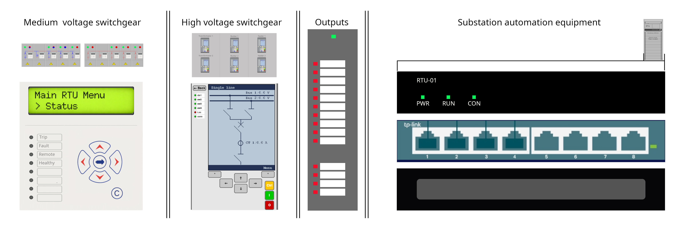

# Frontpanel

overview
* MS relay
* HS relay
* Output
* Substation automation

## General operating description.
modify via local control, modify via station HMI, modify via remote SCADA DMS. Measure power via duspel, observe outputs energised.

## Comissioning steps. 
First enable incoming HS feed and switch disconnectors to select Bus, Energize bus with feed circuit-breaker. Then energize transformers; first select bus with disconnectors, then energise with circuit-breaker. Then enable MS incoming feed, observe MS voltage on bus. Then enable outgoing MS feeds to see current flow in the system.

## Simulate shorts
short to ground on busbar
short to phase on busbar
observe protection kicking in (Feed, or Busbar if feed does not react in time)

## MS relay

Control 10 MS relais

## HS relay

Control 6 IEC 61850 HS IED's

## Output

Status indicators of outputs

10 disonnector switches

4 protection relais

## Substation automation

* RTU with 3 indicator leds
* Substation switch
* Cable entry panel